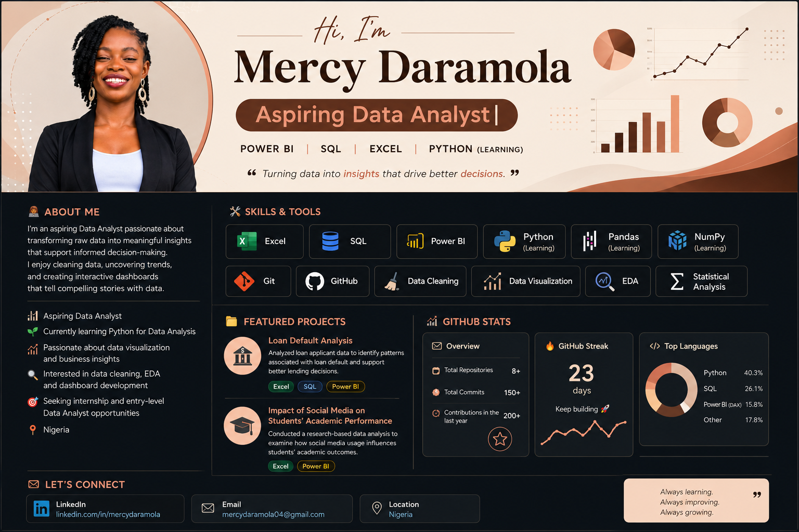

  

  

# Hi there, I'm Mercy Daramola 👋

Welcome to my GitHub!

I'm a **Data Analyst** passionate about transforming raw data into meaningful insights that support informed decision-making. I enjoy cleaning data, uncovering trends, and creating interactive dashboards that tell compelling stories with data.

## 👩🏽‍💻 About Me

- 📊 Junior Data Analyst
- 📈 Passionate about data visualization and business insights
- 🌱 Currently improving my skills in SQL, Power BI, Tableau, Excel(Advanced), and Python
- 🔍 Interested in data cleaning, exploratory data analysis (EDA), and dashboard development
- 🎯 Seeking internship and entry-level Data Analyst opportunities

## 🛠️ Skills

- Microsoft Excel (Advanced)
- SQL
- Power BI
- Tableau
- Data Cleaning
- Data Visualization
- Exploratory Data Analysis (EDA)
- Statistical Analysis
- Git & GitHub (Learning)

## 📂 Featured Projects

### 📊 Loan Default Analysis
Analyzed loan applicant data to identify patterns associated with loan default and support better lending decisions.

**Tools:** Excel, SQL, Power BI

---

### 📚 Impact of Social Media on Students' Academic Performance in tertiary institutions.
Conducted a research-based data analysis to examine how social media usage influences students' academic outcomes.

**Tools:** Excel, Power BI

## 📖 Currently Learning

- Advanced SQL
- Python for Data Analysis
- Pandas
- NumPy
- Data Storytelling
- Git & GitHub

## 📫 Let's Connect

- LinkedIn: *(www.linkedin.com/in/mercyy-daramola)*
- Email: *(mercydaramola23@gmail.com)*

Thanks for stopping by! Feel free to explore my repositories and connect with me.
